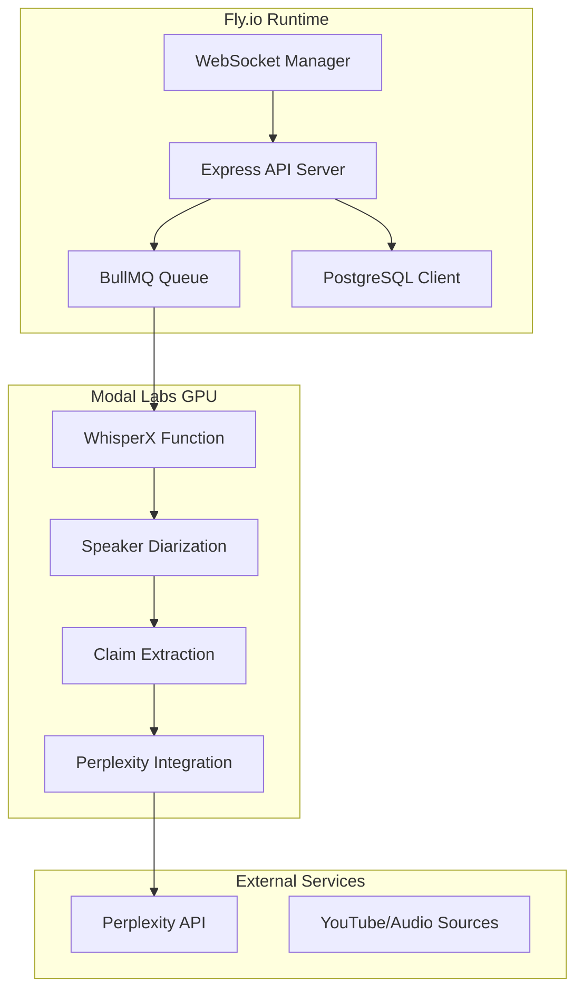

# OnlyTruth Backend - System Patterns

## Architecture Overview

### Hybrid Cloud Architecture
The backend extends the proven YouTube transcription system architecture:
- **Fly.io**: API orchestration, WebSocket management, database operations
- **Modal Labs**: GPU-intensive AI processing (transcription, diarization, LLM analysis)
- **PostgreSQL**: Persistent data storage with ACID compliance
- **Redis**: BullMQ job queue and WebSocket session management

### System Integration Pattern


## Core System Patterns

### 1. Pipeline Processing Pattern
The debate analysis follows a sequential pipeline extending existing patterns:

```typescript
// Existing Pattern Extended
class DebateProcessor {
  async processDebate(input: DebateInput): Promise<DebateResult> {
    // Stage 1: Audio Processing (Reused)
    const audio = await this.audioProcessor.process(input);
    
    // Stage 2: Transcription (Reused)
    const transcription = await this.whisperXProcessor.transcribe(audio);
    
    // Stage 3: Speaker Diarization (New)
    const speakers = await this.speakerDiarizer.identify(audio, transcription);
    
    // Stage 4: Claim Extraction (New)
    const claims = await this.claimExtractor.extract(transcription, speakers);
    
    // Stage 5: Fact Checking (New)
    const factChecks = await this.factChecker.verify(claims);
    
    // Stage 6: Result Assembly
    return this.assembleResults(transcription, speakers, claims, factChecks);
  }
}
```

### 2. Job Queue Architecture
Extending existing BullMQ patterns with new job types:

```typescript
// Existing job types continue to work
enum JobType {
  YOUTUBE_TRANSCRIPTION = 'youtube-transcription',  // Existing
  DEBATE_ANALYSIS = 'debate-analysis',              // New
  LIVE_DEBATE_STREAM = 'live-debate-stream',        // New
  CLAIM_FACT_CHECK = 'claim-fact-check'             // New
}

// Shared queue worker patterns
class QueueWorker {
  async processJob(job: Job) {
    switch (job.data.type) {
      case JobType.YOUTUBE_TRANSCRIPTION:
        return this.processYouTubeTranscription(job);  // Existing
      case JobType.DEBATE_ANALYSIS:
        return this.processDebateAnalysis(job);        // New
      // ... other cases
    }
  }
}
```

### 3. Real-time Streaming Pattern
WebSocket architecture for live debate streaming:

```typescript
class DebateStreamManager {
  private activeStreams = new Map<string, DebateStream>();
  
  async startDebateStream(debateId: string): Promise<void> {
    const stream = new DebateStream(debateId);
    
    // Real-time audio processing
    stream.on('audio-chunk', async (chunk) => {
      const result = await this.processAudioChunk(chunk);
      this.broadcastUpdate(debateId, result);
    });
    
    // Progressive result updates
    stream.on('transcription-update', (update) => {
      this.broadcastToClients(debateId, 'transcription', update);
    });
    
    stream.on('claim-detected', (claim) => {
      this.broadcastToClients(debateId, 'claim', claim);
    });
    
    this.activeStreams.set(debateId, stream);
  }
}
```

## Data Architecture Patterns

### 1. Database Schema Extension
Building on existing schema patterns:

```sql
-- Existing tables continue to work unchanged
-- youtube_jobs, transcription_results, etc.

-- New debate-specific tables
CREATE TABLE debates (
    id UUID PRIMARY KEY DEFAULT gen_random_uuid(),
    title TEXT NOT NULL,
    source_type TEXT NOT NULL, -- 'youtube', 'upload', 'live'
    source_url TEXT,
    status TEXT DEFAULT 'pending',
    created_at TIMESTAMP DEFAULT NOW(),
    metadata JSONB
);

CREATE TABLE debate_speakers (
    id UUID PRIMARY KEY DEFAULT gen_random_uuid(),
    debate_id UUID REFERENCES debates(id) ON DELETE CASCADE,
    speaker_identifier TEXT NOT NULL,
    speaker_name TEXT,
    voice_embedding VECTOR(512), -- For speaker consistency
    created_at TIMESTAMP DEFAULT NOW()
);

CREATE TABLE debate_segments (
    id UUID PRIMARY KEY DEFAULT gen_random_uuid(),
    debate_id UUID REFERENCES debates(id) ON DELETE CASCADE,
    speaker_id UUID REFERENCES debate_speakers(id),
    start_time DECIMAL NOT NULL,
    end_time DECIMAL NOT NULL,
    text TEXT NOT NULL,
    confidence DECIMAL,
    created_at TIMESTAMP DEFAULT NOW()
);

CREATE TABLE claims (
    id UUID PRIMARY KEY DEFAULT gen_random_uuid(),
    segment_id UUID REFERENCES debate_segments(id) ON DELETE CASCADE,
    text TEXT NOT NULL,
    claim_type TEXT NOT NULL, -- 'fact', 'prediction', 'opinion'
    confidence DECIMAL NOT NULL,
    context TEXT, -- Surrounding text for context
    created_at TIMESTAMP DEFAULT NOW()
);

CREATE TABLE fact_checks (
    id UUID PRIMARY KEY DEFAULT gen_random_uuid(),
    claim_id UUID REFERENCES claims(id) ON DELETE CASCADE,
    verdict TEXT NOT NULL, -- 'true', 'false', 'mixed', 'unverifiable'
    confidence DECIMAL NOT NULL,
    sources JSONB NOT NULL, -- Array of source objects
    reasoning TEXT,
    checked_at TIMESTAMP DEFAULT NOW()
);
```

### 2. Caching Strategy Pattern
Multi-level caching for performance optimization:

```typescript
class CacheManager {
  // Level 1: In-memory cache for hot data
  private memoryCache = new Map<string, any>();
  
  // Level 2: Redis cache for session data
  private redisCache: Redis;
  
  // Level 3: Database with optimized queries
  private database: DatabaseClient;
  
  async getCachedFactCheck(claimText: string): Promise<FactCheck | null> {
    // Check memory first
    const memKey = `fact-check:${hash(claimText)}`;
    if (this.memoryCache.has(memKey)) {
      return this.memoryCache.get(memKey);
    }
    
    // Check Redis
    const redisKey = `fact-check:${hash(claimText)}`;
    const cached = await this.redisCache.get(redisKey);
    if (cached) {
      const result = JSON.parse(cached);
      this.memoryCache.set(memKey, result);
      return result;
    }
    
    // Check database for similar claims
    return this.database.findSimilarFactCheck(claimText);
  }
}
```

## Integration Patterns

### 1. Modal Labs Function Pattern
Extending existing Modal integration:

```python
# Existing Modal app extended with new functions
import modal

app = modal.App("debate-analysis")

# Existing function continues to work
@app.function(gpu="A10G", timeout=600)
def transcribe_youtube(youtube_url: str, job_id: str) -> dict:
    # Existing YouTube transcription logic
    pass

# New debate analysis functions
@app.function(gpu="A10G", timeout=300)
def analyze_debate_segment(
    audio_data: bytes, 
    transcript: str,
    context: dict
) -> dict:
    """Analyze debate segment for speakers and claims"""
    
    # Speaker diarization using pyannote.audio
    speakers = identify_speakers(audio_data)
    
    # Claim extraction using LLM
    claims = extract_claims(transcript, speakers, context)
    
    return {
        "speakers": speakers,
        "claims": claims,
        "confidence": calculate_confidence(speakers, claims)
    }

@app.function(timeout=120)
def fact_check_claims(claims: list[dict], context: dict) -> dict:
    """Fact-check extracted claims using Perplexity API"""
    
    results = []
    for claim in claims:
        # Use Perplexity API for fact-checking
        fact_check = verify_claim_with_perplexity(claim["text"])
        results.append({
            "claim_id": claim["id"],
            "verdict": fact_check["verdict"],
            "confidence": fact_check["confidence"],
            "sources": fact_check["sources"]
        })
    
    return {"fact_checks": results}
```

### 2. WebSocket Communication Pattern
Real-time bidirectional communication:

```typescript
class WebSocketHandler {
  private io: SocketIO.Server;
  
  setupDebateHandlers() {
    this.io.on('connection', (socket) => {
      // Join debate room
      socket.on('join-debate', (debateId: string) => {
        socket.join(`debate:${debateId}`);
        this.sendDebateState(socket, debateId);
      });
      
      // Handle live audio input
      socket.on('audio-chunk', async (data) => {
        const { debateId, audioData } = data;
        await this.processLiveAudio(debateId, audioData);
      });
      
      // Handle client commands
      socket.on('pause-processing', (debateId: string) => {
        this.pauseDebateProcessing(debateId);
      });
    });
  }
  
  // Broadcast updates to all clients in debate room
  broadcastDebateUpdate(debateId: string, type: string, data: any) {
    this.io.to(`debate:${debateId}`).emit(type, data);
  }
}
```

### 3. Error Handling Pattern
Comprehensive error recovery extending existing patterns:

```typescript
class ErrorHandler {
  async handleProcessingError(
    error: Error, 
    context: ProcessingContext
  ): Promise<void> {
    // Log error with context
    logger.error('Processing error', {
      error: error.message,
      stack: error.stack,
      context,
      debateId: context.debateId
    });
    
    // Determine recovery strategy
    if (error instanceof TranscriptionError) {
      await this.handleTranscriptionFailure(context);
    } else if (error instanceof FactCheckError) {
      await this.handleFactCheckFailure(context);
    } else if (error instanceof NetworkError) {
      await this.handleNetworkFailure(context);
    }
    
    // Notify clients of error state
    this.notifyClientsOfError(context.debateId, {
      type: error.constructor.name,
      message: this.getPublicErrorMessage(error),
      canRetry: this.isRetryable(error)
    });
  }
  
  private async handleFactCheckFailure(context: ProcessingContext) {
    // Mark claims as "fact-check pending"
    await this.markClaimsAsPending(context.claimIds);
    
    // Queue for retry with exponential backoff
    await this.queueFactCheckRetry(context);
    
    // Continue processing other claims
    await this.continueWithoutFailedClaims(context);
  }
}
```

## Performance Optimization Patterns

### 1. Concurrent Processing Pattern
Parallel processing where possible:

```typescript
class PerformanceOptimizer {
  async processDebateSegments(segments: AudioSegment[]): Promise<DebateResult[]> {
    // Process transcription in parallel
    const transcriptionPromises = segments.map(segment => 
      this.transcribeSegment(segment)
    );
    const transcriptions = await Promise.all(transcriptionPromises);
    
    // Process speaker identification in parallel
    const speakerPromises = segments.map((segment, index) =>
      this.identifySpeakers(segment, transcriptions[index])
    );
    const speakers = await Promise.all(speakerPromises);
    
    // Batch claim extraction to optimize LLM usage
    const allClaims = await this.batchExtractClaims(transcriptions, speakers);
    
    // Batch fact-checking to optimize API usage
    const factChecks = await this.batchFactCheck(allClaims);
    
    return this.assembleResults(transcriptions, speakers, allClaims, factChecks);
  }
}
```

### 2. Cost Optimization Pattern
Intelligent API usage to minimize costs:

```typescript
class CostOptimizer {
  async optimizeFactChecking(claims: Claim[]): Promise<FactCheck[]> {
    // Deduplicate similar claims
    const uniqueClaims = this.deduplicateClaims(claims);
    
    // Check cache first
    const cachedResults = await this.checkFactCheckCache(uniqueClaims);
    
    // Only fact-check new claims
    const newClaims = uniqueClaims.filter(claim => 
      !cachedResults.has(claim.id)
    );
    
    // Batch new claims for efficient API usage
    const batchSize = 5; // Optimize for Perplexity rate limits
    const batches = this.createBatches(newClaims, batchSize);
    
    const newResults = [];
    for (const batch of batches) {
      const batchResults = await this.factCheckBatch(batch);
      newResults.push(...batchResults);
      
      // Rate limiting delay
      await this.delay(1000);
    }
    
    // Combine cached and new results
    return this.combineResults(cachedResults, newResults);
  }
}
```

## Monitoring and Observability Patterns

### 1. Comprehensive Logging Pattern
Structured logging for debugging and monitoring:

```typescript
class Logger {
  logDebateProcessing(debateId: string, stage: string, metadata: any) {
    logger.info('Debate processing stage', {
      debateId,
      stage,
      timestamp: new Date().toISOString(),
      duration: metadata.duration,
      success: metadata.success,
      metrics: {
        segments_processed: metadata.segmentCount,
        claims_extracted: metadata.claimCount,
        fact_checks_completed: metadata.factCheckCount
      }
    });
  }
  
  logPerformanceMetrics(debateId: string, metrics: PerformanceMetrics) {
    logger.info('Performance metrics', {
      debateId,
      metrics: {
        total_processing_time: metrics.totalTime,
        transcription_time: metrics.transcriptionTime,
        diarization_time: metrics.diarizationTime,
        claim_extraction_time: metrics.claimExtractionTime,
        fact_check_time: metrics.factCheckTime
      }
    });
  }
}
```

### 2. Health Check Pattern
Comprehensive system health monitoring:

```typescript
class HealthChecker {
  async checkSystemHealth(): Promise<HealthStatus> {
    const checks = await Promise.allSettled([
      this.checkDatabase(),
      this.checkRedis(),
      this.checkModalLabs(),
      this.checkPerplexityAPI(),
      this.checkWebSocketConnections()
    ]);
    
    return {
      status: checks.every(check => check.status === 'fulfilled') ? 'healthy' : 'degraded',
      checks: checks.map((check, index) => ({
        name: this.checkNames[index],
        status: check.status === 'fulfilled' ? 'up' : 'down',
        details: check.status === 'rejected' ? check.reason : check.value
      })),
      timestamp: new Date().toISOString()
    };
  }
} 